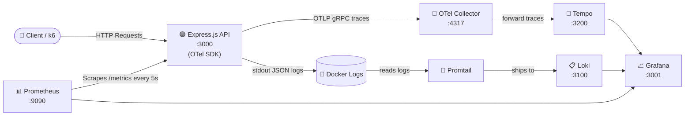

# แนะนำ Observability สำหรับ Back-end Developers
### Workshop แบบลงมือทำ · 1 ชั่วโมง · Docker Compose

> **ระดับ:** Beginner → Junior  
> **เวลา:** 60 นาที  
> **สิ่งที่ต้องมีก่อน:** ติดตั้ง Docker Desktop, มีความรู้พื้นฐานเรื่อง REST API

---

## 🚀 Quick Start (3 Commands)

```bash
# 1. Clone / enter the project folder
cd observability-workshop

# 2. Start all services
docker compose up -d --build

# 3. Open Grafana
# → http://localhost:3001  (admin / admin)
```

**Services ที่รันอยู่:**

| Service        | URL                        | หน้าที่                          |
|----------------|----------------------------|---------------------------------|
| API            | http://localhost:3000      | Demo Express.js API             |
| Prometheus     | http://localhost:9090      | รวบรวมและเก็บ metrics             |
| Grafana        | http://localhost:3001      | แสดง dashboard และกราฟ          |
| Loki           | http://localhost:3100      | เก็บ logs                        |
| Tempo          | http://localhost:3200      | เก็บ distributed traces          |
| OTel Collector | (internal :4317/:4318)     | รับและส่งต่อ telemetry           |

---

## 🏗 Architecture



**การไหลของข้อมูล:**
- **Metrics:** API เปิด endpoint `/metrics` → Prometheus *ดึงข้อมูล* ทุก 5 วินาที → Grafana query จาก Prometheus
- **Logs:** API เขียน JSON ออก stdout → Docker รับ → Promtail อ่านและส่งต่อ Loki → Grafana query จาก Loki
- **Traces:** OTel SDK instrument Express.js อัตโนมัติ → ส่ง spans ไป OTel Collector → Tempo → Grafana (link ถึง Loki logs ได้)

---

## 📁 โครงสร้างโปรเจ็กต์

```
observability-workshop/
│
├── docker-compose.yml          ← เริ่มทุกอย่างด้วยคำสั่งเดียว
│
├── api/                        ← Express.js demo API
│   ├── Dockerfile
│   ├── package.json
│   └── src/
│       ├── index.js            ← ไฟล์หลัก: routes, metrics, logging
│       └── tracing.js          ← OTel SDK init (ต้อง require ก่อนสุด)
│
├── prometheus/
│   └── prometheus.yml          ← ตั้งค่า scrape
│
├── loki/
│   └── loki-config.yml         ← ตั้งค่าการเก็บ logs
│
├── promtail/
│   └── promtail-config.yml     ← ตั้งค่าการรวบรวม logs
│
├── otel-collector/
│   └── otel-collector-config.yml  ← รับ traces จาก API, ส่งต่อ Tempo
│
├── tempo/
│   └── tempo-config.yml        ← เก็บ distributed traces
│
├── grafana/
│   ├── provisioning/
│   │   ├── datasources/        ← เชื่อมต่อ Prometheus + Loki อัตโนมัติ
│   │   └── dashboards/         ← โหลด dashboard อัตโนมัติ
│   └── dashboards/
│       └── workshop-dashboard.json  ← Dashboard สำเร็จรูป
│
├── k6/
│   └── load.js                 ← สคริปต์โหลดเทส
│
├── docs/
│   ├── WORKSHOP_GUIDE.md       ← คู่มือ workshop และสคริปต์การสอน
│   └── LABS.md                 ← Labs แบบ step-by-step
│
└── CHEATSHEET.md               ← คำสั่งอ้างอิงฉบับย่อ
```

---

## 🧪 API Endpoints

| Endpoint   | พฤติกรรม                                    | จุดประสงค์ใน Workshop          |
|------------|-----------------------------------------|--------------------------------|
| `GET /health` | ส่ง 200 เสมอ                        | ตรวจสอบ health พื้นฐาน         |
| `GET /users`  | ตอบเร็ว (~5ms)                      | จำลอง traffic ปกติ           |
| `GET /slow`   | หน่วง 1–3 วินาที (สุ่ม)           | แสดงปัญหาเวลาตอบสนอง       |
| `GET /error`  | ผิดพลาด 70% ของเวลา                | แสดงปัญหา error rate             |
| `GET /metrics`| Prometheus metrics (ใช้ภายใน)    | ห้ามเปิดสู่สาธารณะ!         |

### Quick test:
```bash
curl http://localhost:3000/health
curl http://localhost:3000/users
curl http://localhost:3000/slow
curl http://localhost:3000/error
```

---

## 📊 Metrics สำคัญที่ควรสังเกตใน Grafana

| ชื่อ Metric                          | ประเภท   | บอกอะไร                           |
|--------------------------------------|-----------|----------------------------------|
| `http_requests_total`                | Counter   | จำนวน requests ทั้งหมด แยกตาม endpoint |
| `http_request_duration_seconds`      | Histogram | เวลาตอบสนอง (P50, P95, P99)     |
| `http_active_requests`               | Gauge     | requests ที่กำลังประมวลผลอยู่   |
| `api_errors_total`                   | Counter   | ข้อผิดพลาดแยกตาม route           |
| `nodejs_process_heap_bytes`          | Gauge     | การใช้งาน heap memory          |
| `nodejs_nodejs_eventloop_lag_seconds`| Gauge     | สัญญาณว่า server โหลดหนัก          |

### PromQL ที่ใช้บ่อย

```promql
# Overall request rate (per second)
sum(rate(http_requests_total[1m]))

# Error rate percentage
sum(rate(http_requests_total{status_code=~"5.."}[1m]))
  / sum(rate(http_requests_total[1m])) * 100

# P95 response time (across all routes)
histogram_quantile(0.95,
  sum(rate(http_request_duration_seconds_bucket[1m])) by (le)
)

# Request rate broken down by endpoint
sum(rate(http_requests_total[1m])) by (route)
```

---

## 🔍 LogQL ที่ใช้บ่อย

```logql
# All API logs
{job="api"}

# Error logs only
{job="api"} |= `"level":"error"`

# Slow endpoint logs
{job="api"} |= `"/slow"`

# Logs with response time > 2000ms
{job="api"} | json | duration_ms > 2000
```

---

## 🔥 รัน Load Test

```bash
# รัน k6 load test (3.5 นาที)
docker compose run --rm k6 run /scripts/load.js

# ทดสอบสั้น (30 วินาที, 5 ผู้ใช้)
docker compose run --rm k6 run --vus 5 --duration 30s /scripts/load.js

# ทดสอบหนัก (50 virtual users)
docker compose run --rm k6 run --vus 50 --duration 60s /scripts/load.js
```

เปิด Grafana **ไว้ขณะที่** k6 กำลังรัน เพื่อดู metrics เปลี่ยนแปลงแบบ real time!

---

## 🛑 หยุดทุกอย่าง

```bash
# หยุด containers ทั้งหมด (เก็บข้อมูลไว้)
docker compose down

# หยุดและลบข้อมูลทั้งหมด (เริ่มใหม่สะอาด)
docker compose down -v
```

---

## 🔧 การแก้ไขปัญหา

| ปัญหา | วิธีแก้ไข |
|---------|----------|
| Grafana ว่าง / ไม่มีข้อมูล | รอ 30 วินาทีหลังเริ่มต้น แล้วตรวจ Prometheus targets |
| Prometheus "No data" | เปิด http://localhost:9090/targets — API ต้องขึ้นเป็น UP |
| Logs ไม่ปรากฏใน Grafana | ตรวจ Promtail: `docker logs workshop-promtail` |
| Port ถูกใช้งานแล้ว | เปลี่ยน ports ใน docker-compose.yml (เช่น `3001:3000` → `3002:3000`) |
| Container ไม่สมบูรณ์ | รัน `docker compose ps` และ `docker compose logs <service>` |
| k6 "connection refused" | ตรวจว่า API ทำงานอยู่: `curl http://localhost:3000/health` |

ดู [docs/WORKSHOP_GUIDE.md](docs/WORKSHOP_GUIDE.md) สำหรับคู่มือการแก้ไขปัญหาแบบละเอียด

---

## 📚 เอกสารประกอบ

- [docs/WORKSHOP_GUIDE.md](docs/WORKSHOP_GUIDE.md) — คู่มือ workshop ครบถ้วน, สถาปัตยกรรม, สคริปต์การสอน
- [docs/LABS.md](docs/LABS.md) — Labs แบบ step-by-step
- [CHEATSHEET.md](CHEATSHEET.md) — คำสั่งอ้างอิงฉบับย่อ

---

## 🙏 Tech Stack

| เครื่องมือ | เวอร์ชัน | หน้าที่                       |
|------------|----------|---------------------------|
| Express.js | 4.x      | Demo API                  |
| Prometheus | 2.52     | เก็บรวบรวม metrics          |
| Grafana    | 10.4     | แสดงผล                     |
| Loki       | 2.9      | รวบรวม logs                |
| Promtail   | 2.9      | เก็บรวบรวม logs             |
| k6         | 0.51     | โหลดเทส                   |
